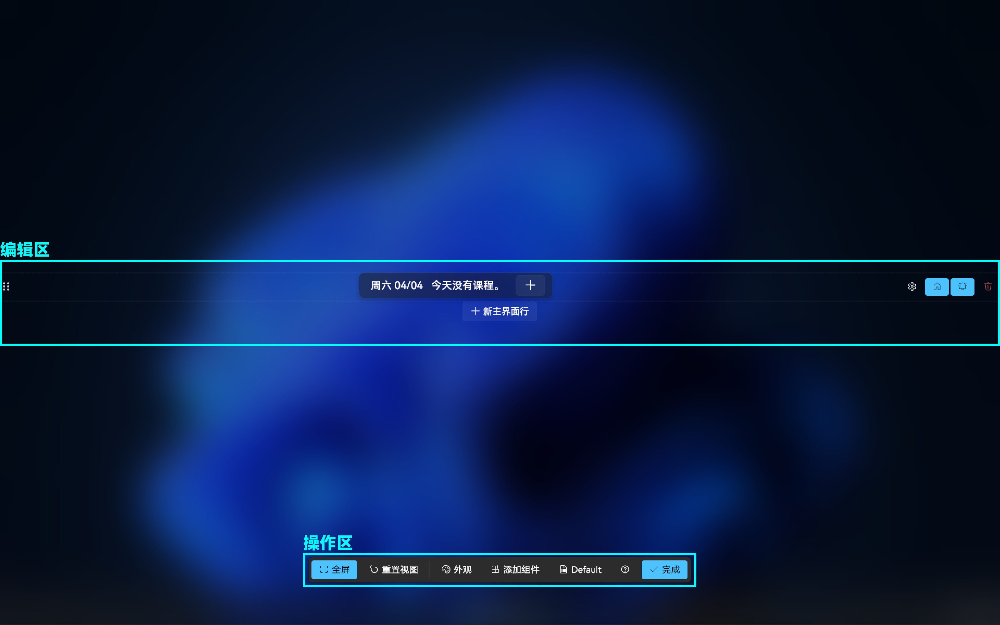
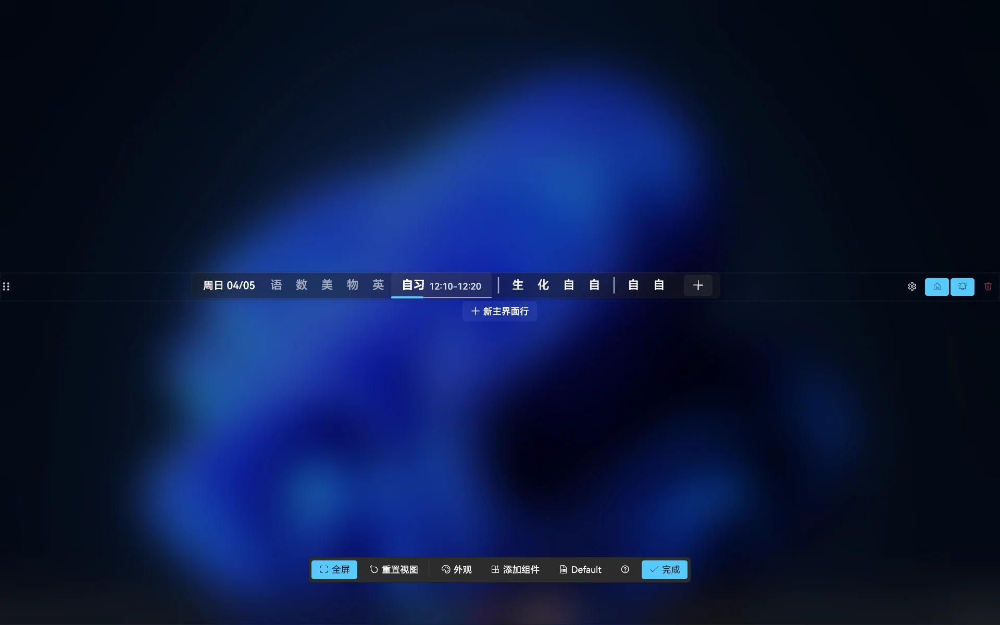
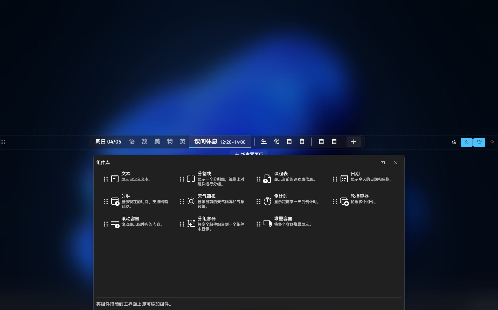
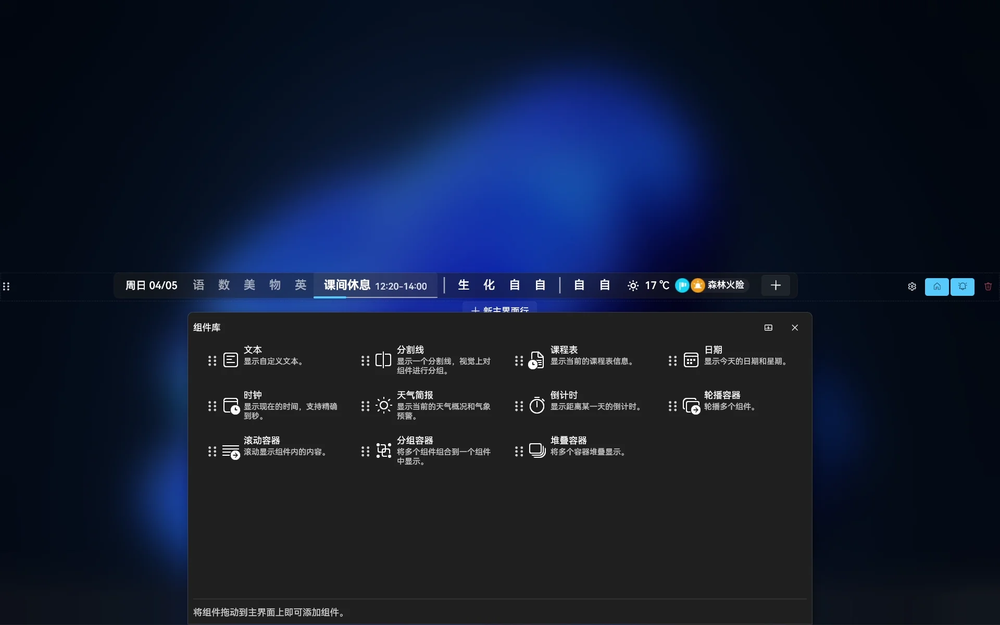
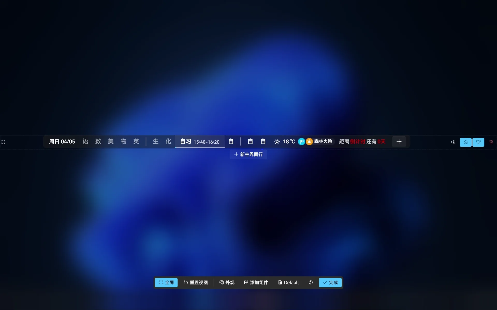
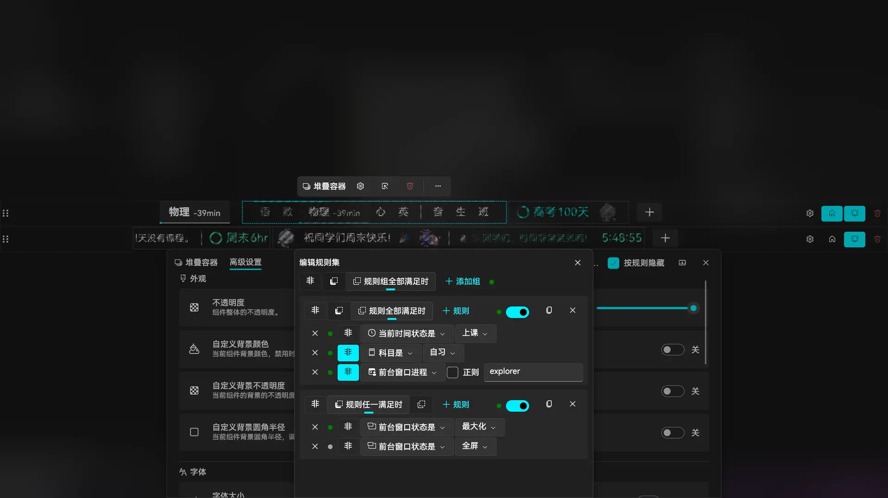
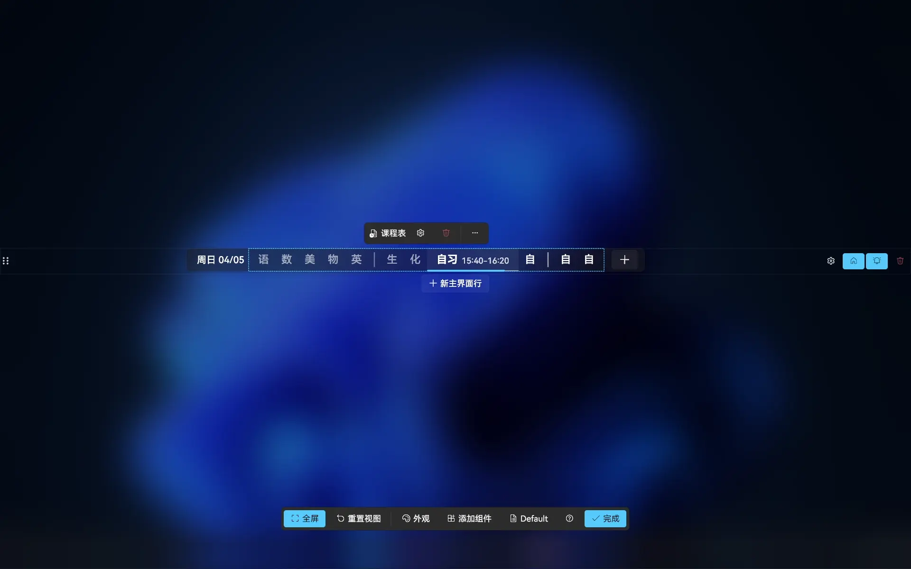
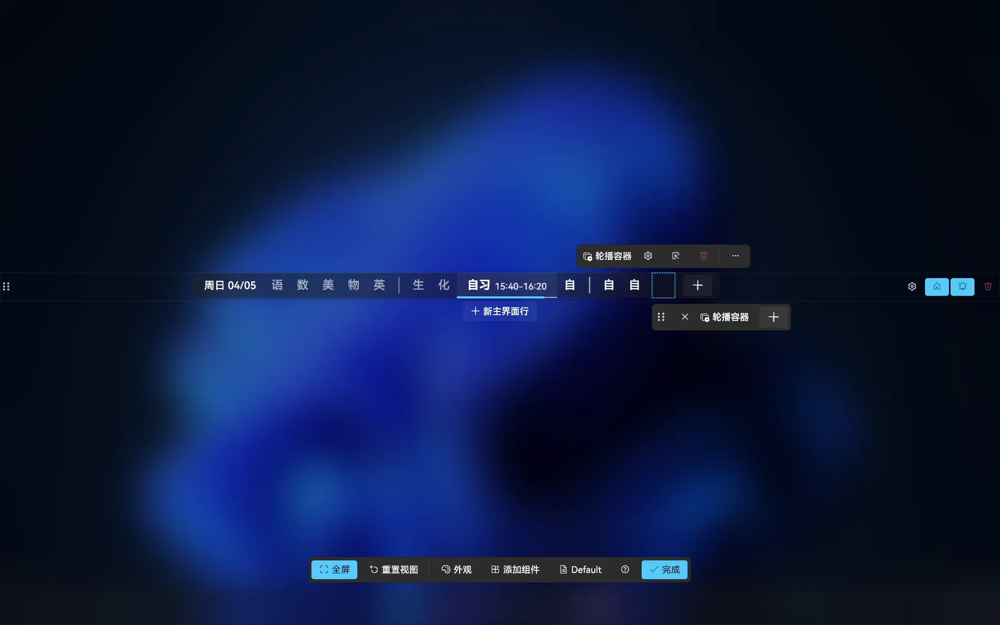
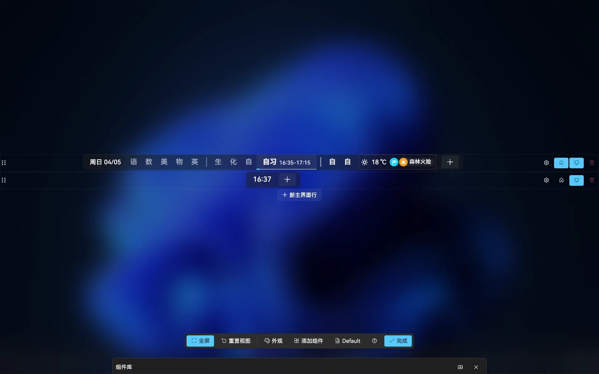

# 编辑主界面

接下来我们将介绍编辑[主界面](./basic.md#主界面)上显示的内容的方法。在了解编辑主界面的方法前，我们先来了解组件的概念。

如图所示，主界面上显示的各个内容，其实是一个个组件组成的。**组件是主界面显示的内容的基本单位。** 我们可以通过编辑主界面上的组件，自定义主界面上显示的内容。

## 初识编辑模式

**我们可以在编辑模式中编辑主界面上显示的内容。** 在进一步介绍前，我们要先进入编辑模式。

**👉 打开主菜单，然后点击【编辑主界面…】选项。**

此时我们进入了如图的编辑模式：

如图，在编辑模式中，界面被划分为”操作区“和”编辑区“。**我们可以在编辑区中编辑主界面的内容，在操作区访问编辑模式的各个功能。**

**主界面上的组件可以直接通过选中并拖拽的方式移动。** 

此外，编辑模式下的视图支持自由移动。**按住鼠标中键并拖动或用手指拖动空白区域以移动视图，滚动鼠标滚轮或双指捏合空白区域即可缩放视图，点击【重置视图】按钮即可重置视图。** 

当编辑完成后，**点击【完成】按钮即可退出编辑模式。**

## 添加组件

我们接下来来了解如何向主界面上添加组件。

**👉 点击【添加组件】按钮，打开组件库。**

这就是组件库了，**我们可以直接将组件从其中拖动到主界面上您想插入此组件的位置，以在对应的位置添加组件。**

**👉 现在，试试拖动您想添加的组件到主界面上吧。**

除了通过拖拽的方式添加组件，我们也可以点击组件行后面的加号【+】来添加组件。

**👉 现在，点击空白区域收起组件库。**

**👉 点击主界面行后的加号【+】。**

**👉 在组件库中选择组件，然后点击右下角的【添加】即可把选中的组件添加到对应的主界面行上。**

## 组件设置

有些组件（比如课程表组件）具有自己的设置，**我们可以通过调整这些组件的设置来进一步定制这些组件。**

**👉 现在，点击选中课表组件，然后点击齿轮图标打开组件设置界面。**

这就是组件的设置页面了，您可以在这里调整对应组件的设置。

**各个组件间的设置一般是互相独立，互不影响的。** 因此您可以在主界面上添加多个相同的组件，但使用不同的设置。

**👉 现在，试试调整这个组件的设置，看看会有什么变化吧。**

此外，我们也可以点击此处为此组件添加隐藏规则，使其在特定情况下自动隐藏。有关规则集的具体用法，我们不在入门教学中介绍，感兴趣的用户可以在文章[自动化](../app/automation.md#规则集)中了解。

## 容器组件

**在 ClassIsland 中，有的组件可以包裹其它组件，这种组件就是容器组件。** 应用内置了滚动容器、轮播容器、分组容器和堆叠容器四种容器组件。在这里我们以轮播容器为例，介绍容器组件的用法。

**👉 使用过上文添加组件的方法，向主界面添加一个轮播容器。**

现在轮播容器已经添加到了主界面上，因为我们还没有往里面添加组件，所以但里面什么也没有。接下来我们要向其中添加组件。

**👉 现在，点击选中这个组件，然后点击展开图标展开容器组件的子组件。**

我们可以看到，**这个容器组件里的子组件就被显示在了划了蓝框的地方。我们可以像编辑主界面行上的组件那样，通过拖拽的方式编辑其中的组件。**

**👉 现在，试试看按照先前向主界面上添加组件的方法，向容器组件中添加组件吧。**

此时我们可以看到，添加进去的组件显示在了主界面上，并且开始了轮播。

> [!tip]
> 您可以按照上面的方法打开轮播容器的组件设置，调整其轮换间隔等设置。不妨试试看吧！

## 主界面行

**应用的主界面由多个主界面行组成** ，接下来我们来介绍如何编辑主界面行。

**👉 点击【新主界面行】按钮，添加一个主界面行。**

我们可以看到我们这里出现了我们刚刚创建的主界面行，**此时我们就可以按照之前的方法，向上面添加组件了。**

**拖动左侧的拖拽图标可以调整主界面行顺序。**

当有多个主界面行时，每个主界面行可以分别显示提醒。

在上图中划蓝圈的是是主界面行操作区。从左到右，这些按钮分别具有这些功能：

| 按钮 | 功能 |
| --- | --- |
| 主界面行设置 | 点击这个齿轮图标的按钮可以展开主界面行设置，您可以在此处调整主界面行范围的隐藏规则和主界面行范围的外观设置。 |
| 主要行 | 点击这个按钮可以将这个主界面行设为主要行，这样提醒会优先在这一行上显示。 |
| 主界面行提醒 | 点击这个铃铛图标的按钮来开关一个主界面的提醒。 |
| 删除主界面行 | 点击这个按钮可以删除这个主界面行。 |

🎉恭喜！您已经掌握了基本的主界面自定义的方法！

如果您还想更深入地了解主界面自定义的方法，可以阅读应用帮助的[组件](../app/component/README.md)章节。
