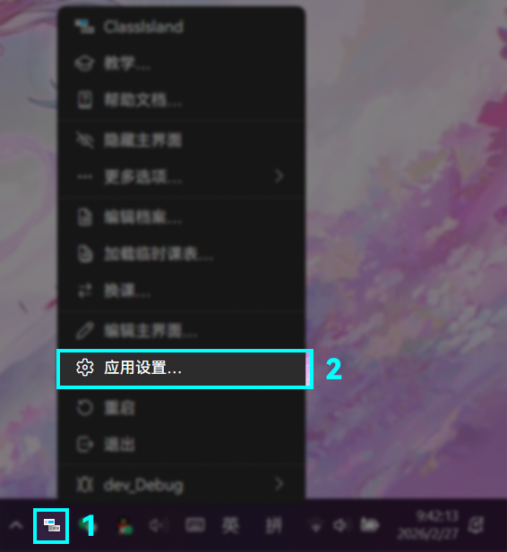
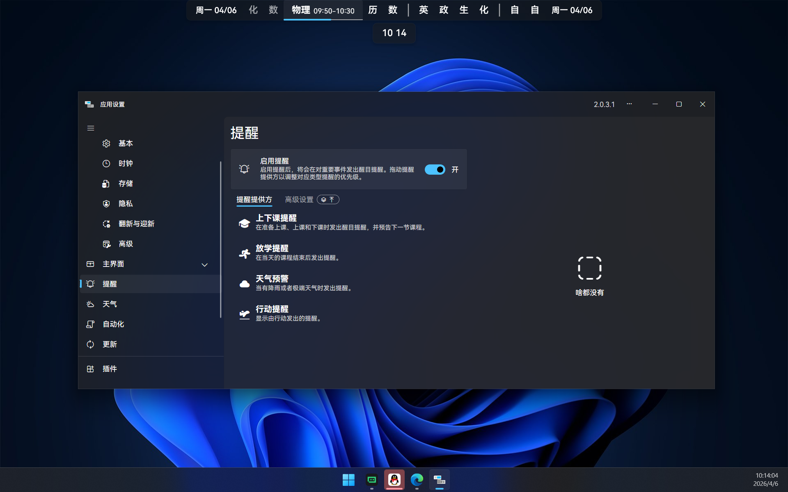
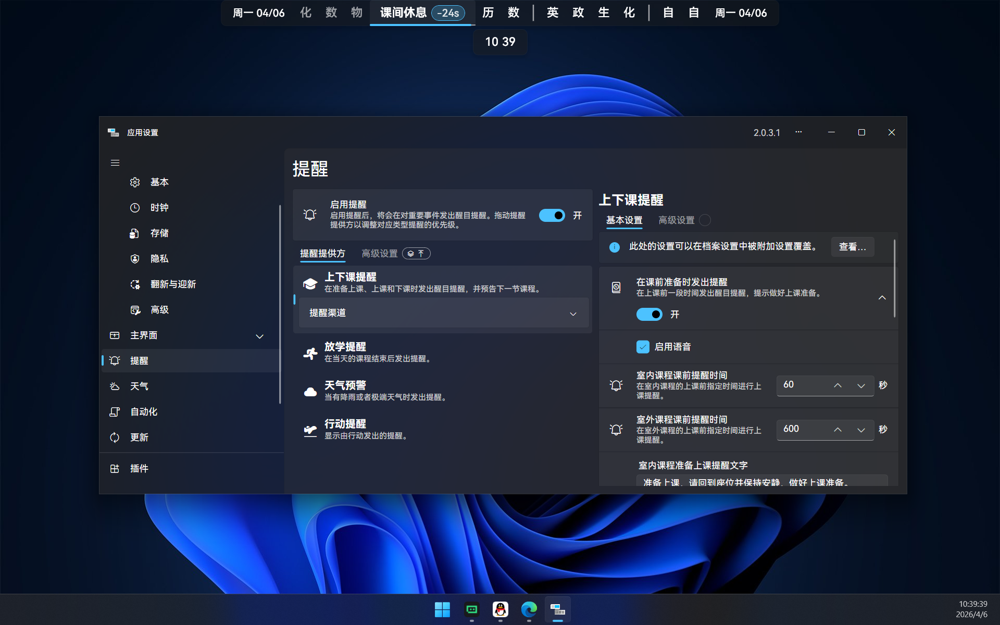
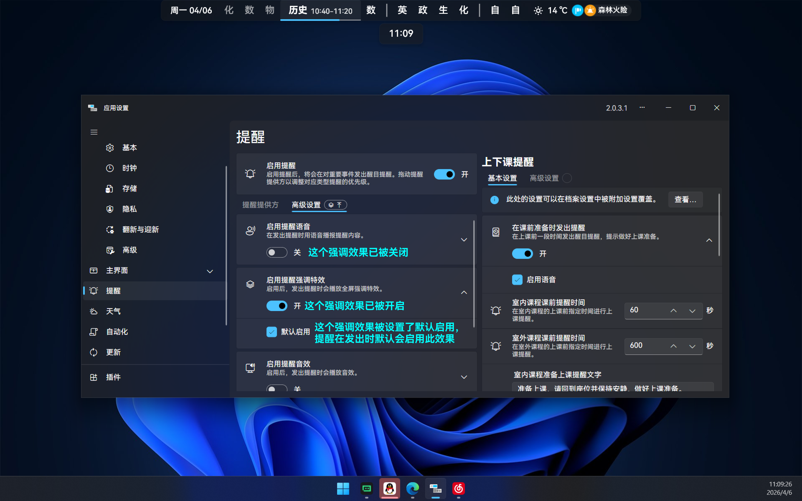
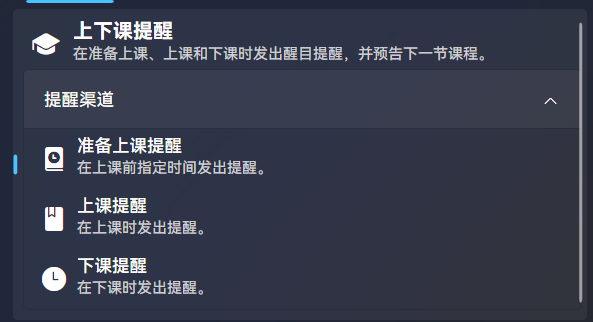
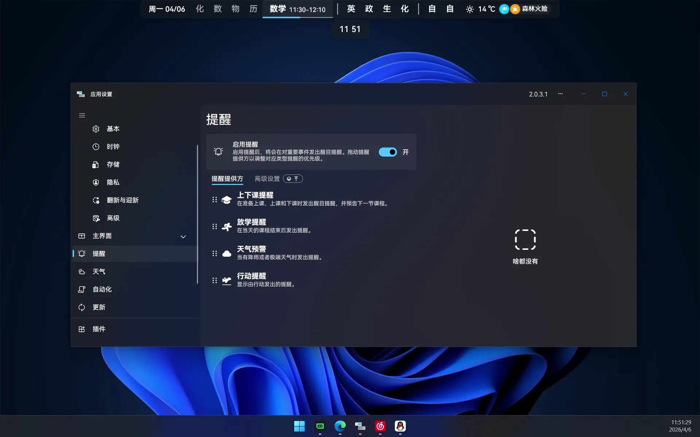

# 上下课提醒

ClassIsland 可以像下图这样在上下课等重要时间点发出提醒。上下课提醒功能是默认开启的，在本文我们将介绍如何自定义上下课提醒功能，如自定义课前提醒的时间和文本等。

要调整上下课设置，我们首先需要打开提醒设置页面。

**👉 打开主菜单，点击【应用设置…】打开应用设置窗口。**

**👉 点击【提醒】导航项。**

此时我们打开了提醒设置页面。

在 ClassIsland 中，**提醒是由各个“提醒提供方”发送到主界面上的** ，正如手机上的各个应用向您发送通知那样。应用的上下课提醒正是由一个名为“上下课提醒”的提醒提供方发送到主界面上的。

ClassIsland 内的提醒管理逻辑也类似于手机上应用的通知管理逻辑，**您可以在提醒设置页面以提醒提供方为单位，设置各个提醒提供方本体的设置和提醒高级设置。**

## 调整提醒设置

要调整上下课提醒的设置，我们需要先选中【上下课提醒】这个提醒提供方，然后才能调整对应的设置。

**👉 点击选中【上下课提醒】提醒提供方选项。**

此时我们打开了上下课提醒的提醒提供方选项，右侧出现了这个提醒提供方的详细设置，我们就可以在这里调整上下课提醒有关的设置了。

ClassIsland 默认的课前提醒时间是一分钟，您可以根据学校实际打上课铃的时间对其进行调整。

**👉 根据实际情况，按需调整课前提醒时间。**

此外，您也可以在这里准备上课提醒等提醒显示的文本。此外，这些设置都支持为特定课表、时间表、时间点或科目的课程启用特殊设置，详细请见应用帮助中的[附加设置](../app/profile/attached-settings.md)，在此不过多介绍。

## 提醒高级设置

除了单纯地在主界面显示提醒以外，**ClassIsland 还支持如水波纹特效、提醒语音、提醒音效和置顶提醒的方式来强调提醒，控制这些强调效果的设置就是“提醒高级设置”。**

**提醒高级设置既可以全局设置，对所有提醒提供方生效，也可以为提醒提供方和提醒渠道（这个我们后面会介绍）单独设置。**

接下来我们来调整全局的提醒高级设置。

**👉 点击左侧面板的【高级设置】选项卡。**

此时我们打开了全局的提醒高级设置。在这里我们可以开启或关闭某些强调效果，也可以设置这些强调效果是否默认启用。**一个强调效果只有在开启时才会生效，而“默认启用”控制了这个强调效果是否对所有提醒提供方默认启用，还是需要在对应的提醒提供方或提醒渠道单独启用。**

::: important 注意区分此处强调效果的“开启”与“启用”，“关闭”与“禁用”的概念
特别地，这里的“开启”和“关闭”指从根本上开关一个强调效果，就像开关一个电器的电源一样。如果一个强调效果被关闭，那么即使在其它地方设置了启用这个强调效果，它也不会被启用，就像电器没有插电不能开机一样。
:::

我们可以看到这里有许多强调效果，我们简要介绍一下它们的作用，您可以根据需求自行开关和配置这些强调效果。

| 强调效果 | 默认开启？ | 说明 |
| --- | --- | --- |
| 提醒语音 | 否 | 在发出提醒时用语音播报提醒内容。 |
| 提醒强调特效 | **是** | 发出提醒时会播放全屏强调特效。 |
| 提醒音效 | 否 | 发出提醒时会播放音效。 |
| 指定提醒 | **是** | 在发出提醒时置顶并强制显示主界面。 |

**👉 按需调整提醒高级设置，看看它们有什么效果。**

### 按提醒提供方调节

正如前面提到的那样，**提醒高级设置可以以提醒提供方为单位调节。提醒提供方中设置的提醒高级设置会覆盖全局设置和提醒请求的设置，但无论如何，在全局设置中关闭的强调效果都不会生效。**

按提醒提供方调整提醒高级设置的操作和调节全局提醒高级设置类似，接下来我们来了解如何按提醒提供方调节提醒高级设置。

要设置一个提醒提供方的提醒高级设置，只需点击右侧的【高级设置】选项卡。

**👉 点击右侧面板的【高级设置】选项卡。**

此时我们打开了这个提醒提供方的提醒高级设置。

在使这些提醒高级设置生效之前，我们要先启用这部分的设置。

**👉 开启【对此提醒来源启用特殊高级设置】选项。**

此时此部分的高级设置就已经生效，并且会覆盖全局设置和提醒提供方要求的设置。您可以在这里根据需要自定义这个提醒提供方的提醒高级设置，达到例如“只有在上下课提醒时启用语音，而其它提醒不启用语音”的效果。

**👉 按需调整提醒提供方的提醒高级设置，看看它们有什么效果。**

## 提醒渠道

有时，**有的提醒提供方会按照发送的提醒类型，再细分出若干提醒渠道，** 例如上下课提醒会按照“上课提醒”、“准备上课提醒”和“下课提醒”这三个提醒类型划分出这三个提醒渠道。而我们可以更进一步地，按提醒渠道来自定义这个提醒提供方发送这一类消息时要使用的提醒高级设置。

要查看提醒渠道，我们要先选中一个有提醒渠道的提醒提供方，然后再展开提醒渠道列表。这里我们以上下课提醒为例讲解。

**👉 点击【上下课提醒】提醒提供方选项，然后展开提醒渠道。**

此时我们可以看到上下课提醒的提醒渠道。我们可以选中其中的提醒渠道，然后像自定义提醒提供方那样定制这个提醒渠道的设置，比如为“下课提醒”提醒渠道启用提醒高级设置，禁用其语音功能等。

**👉 选中一个提醒渠道，然后按上文调整提醒设置的方法，调整这个渠道的提醒设置，看看有什么效果。**

***

**🎉恭喜！您已经掌握了基本的提醒自定义的方法！**

这里我们只粗浅地以上下课提醒为例介绍了提醒的有关操作方法，这些操作方法对于其它提醒提供方也是类似的。如果您想更深入地了解提醒有关的内容，可以阅读帮助文档的[提醒](../app/notifications.md)章节。
