# 下载与安装

本教程将指引您如何下载与安装 ClassIsland。

## 检查系统配置

> [!important]
> 在您要在要运行 ClassIsland 的设备上安装 ClassIsland 前，都应该按照这部分的指引检查系统配置是否符合应用的需求。

要运行 ClassIsland，您的系统必须满足以下任意一条要求：

- **Windows:** Windows 10 及以上版本的系统，x86_64 或 arm64 架构
- **macOS:** macOS Big Sur 11 或更高版本，Intel 或 Apple Silicon
- **Linux:** Debian 10（或其衍生版本）或更高版本，x86_64 或 arm64 架构

所以，我们需要先检查系统配置。根据您使用的操作系统，按照以下步骤查看系统配置信息：

::: tabs#os

@tab Windows

首先，我们要打开系统信息界面。

**👉 按下 <kbd>Win</kbd> + <kbd>R</kbd> 打开【运行】窗口，输入以下命令，然后按下回车：**

``` bat
control /name Microsoft.System
```

运行完命令后，系统应该会打开以下的一个界面，我们要重点关注划红圈的部分：

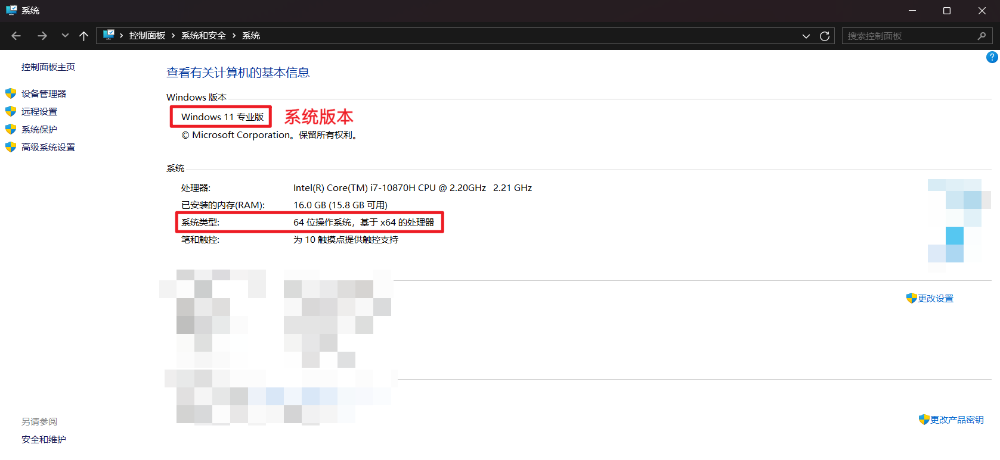

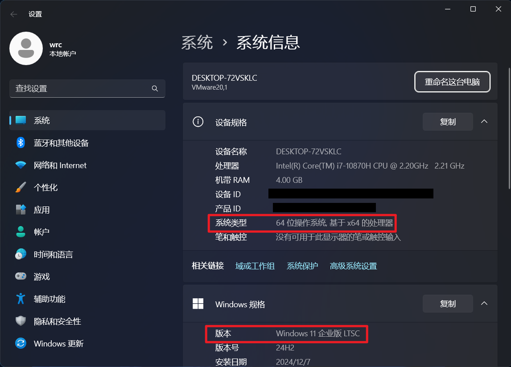

**👉 检查显示的系统要求是否符合 ClassIsland 运行所需的要求。**

如果其中的“系统版本”所显示的系统版本大于或等于 Windows 10，那么您可以在此设备上运行 ClassIsland。

在“系统类型”中显示的是当前设备的架构和安装的系统类型。 **“64 位操作系统”即代表您的操作系统是 x64 架构，“适用于 ARM 的 64 位操作系统”即代表您的操作系统是 arm64 架构。**

**👉 记住此处显示的设备架构和系统类型。**

@tab macOS

**👉 点击左上角的【图标】，然后点击【关于本机】，打开【关于本机】界面。**


此时您应该能看到以下画面，我们要重点关注划红圈的部分：

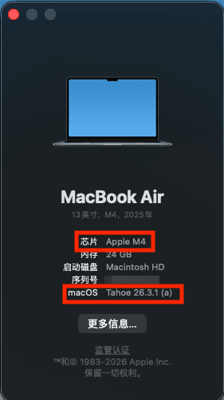

**👉 检查显示的系统要求是否符合 ClassIsland 运行所需的要求。**

如果“macOS”一栏的系统版本大于或等于 11.0，那么您可以在此设备上运行 ClassIsland。

如果“芯片”一栏显示的是以“Apple”开头的芯片（如图中的“Apple M4”），那么您的设备芯片就属于“Apple Silicon”芯片类型。如果“芯片”一栏中有“Intel”字样，则说明您的设备芯片属于“Intel”芯片类型。

**👉 记住此处显示的芯片类型和系统类型。**

@tab 统信 UOS#uos

**👉 打开启动器，然后点击齿轮图标打开【控制中心】。**

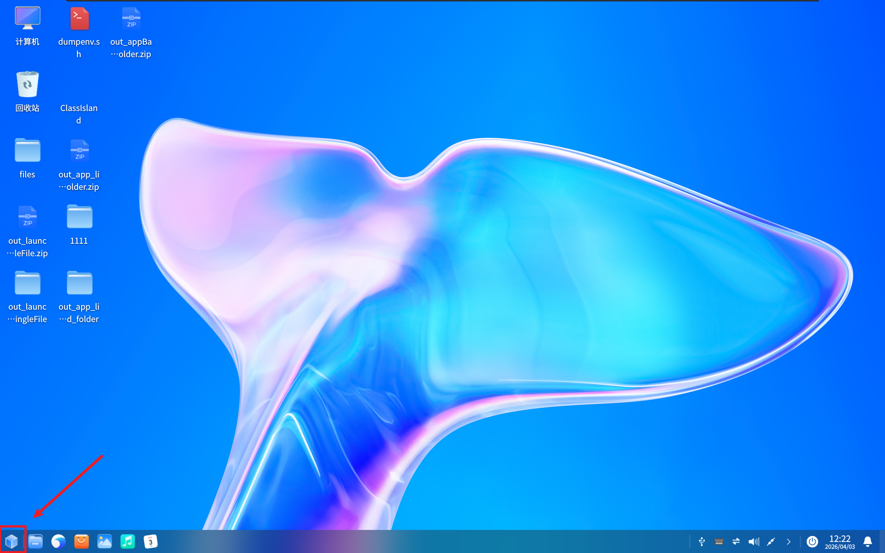

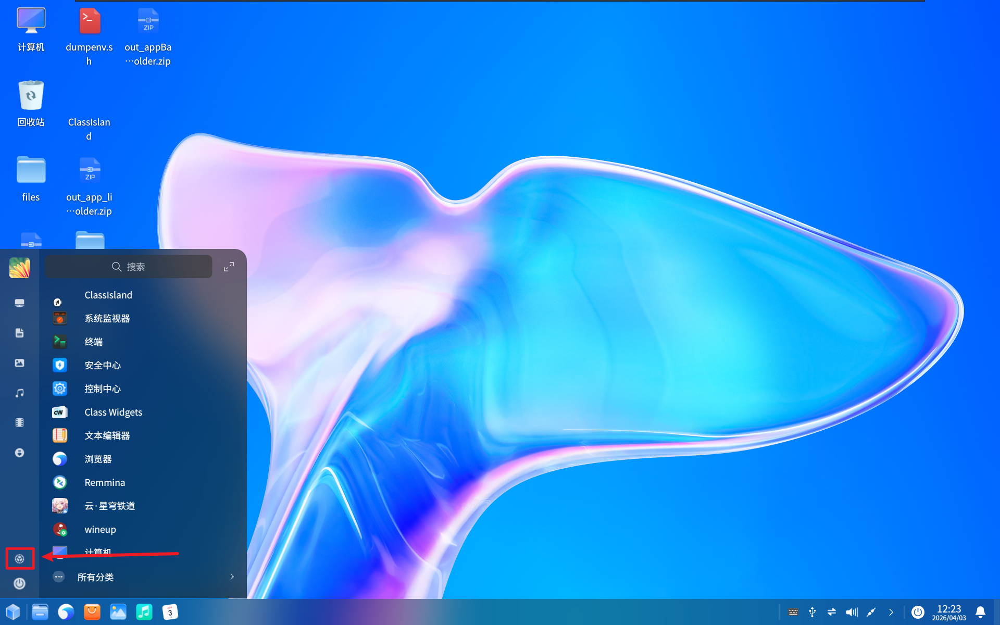

**👉 点击【系统信息】，打开系统信息页面。**

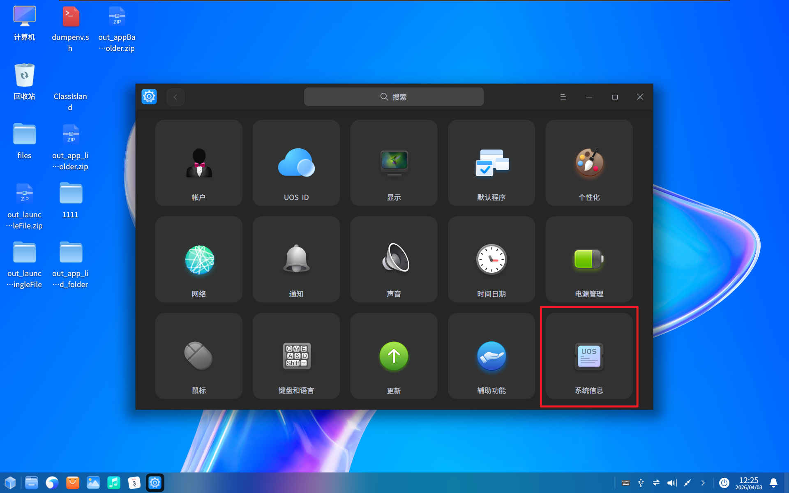

此时我们应该打开如图所示的页面，我们要重点关注划红圈的部分：

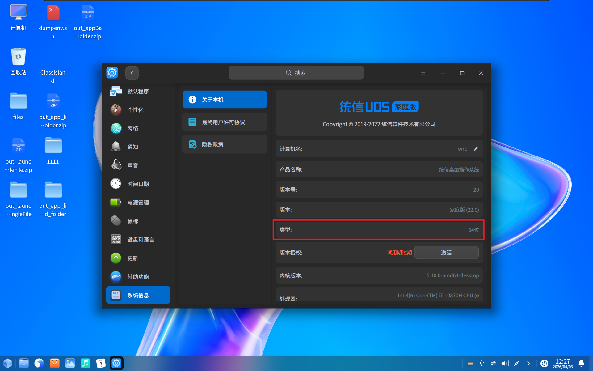

**👉 检查显示的系统要求是否符合 ClassIsland 运行所需的要求。**

目前 ClassIsland 只支持 x86_64 架构和 arm64 架构，因此只有在“类型”一栏显示的架构为“64 位”或“ARM64”时，ClassIsland 才能在这个设备上运行。

**👉 记住此处显示的设备架构和系统类型。**

@tab 银河麒麟#kylin

**👉 在桌面右键，点击【打开终端】。**

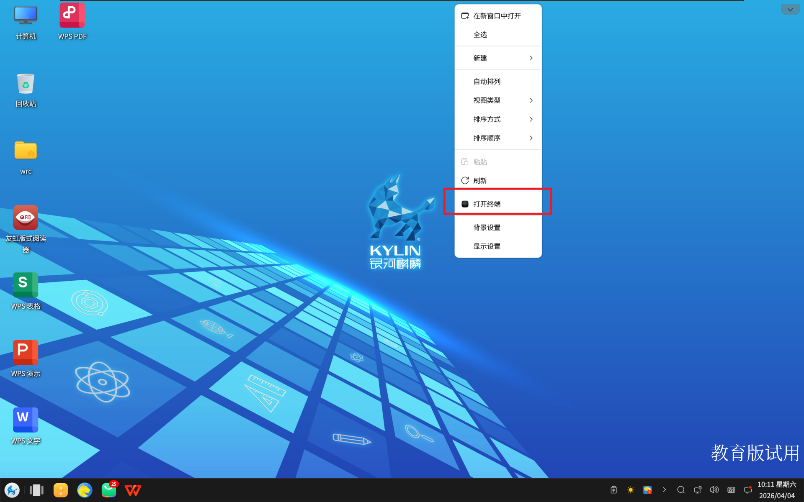

**👉 在终端中运行以下命令以查看系统信息。**

``` bash
echo "GLIBC: $(ldd --version | awk 'NR==1{print $NF}') | Arch: $(uname -m) | Debian: $(cat /etc/debian_version)"
```

此命令应该会产生类似这样的输出：

``` plaintext
GLIBC: 2.35 | Arch: x86_64 | Debian: bookworm/sid
```

**👉 检查显示的系统要求是否符合 ClassIsland 运行所需的要求。**

系统应满足以下要求才能运行 ClassIsland：

- “GLIBC”部分为系统的 glibc 版本，应该大于或等于 2.28
- “Arch”为 CPU 架构，应该为 x86_64 或 aarch64（即 ARM64）
- “Debian”为 Debian 版本，应该大于或等于 10

**👉 记住此处显示的设备架构和系统类型。**

@tab 其它 Debian 衍生 OS#debian

**👉 启动终端，在终端中运行以下命令以查看系统信息。**

``` bash
echo "GLIBC: $(ldd --version | awk 'NR==1{print $NF}') | Arch: $(uname -m) | Debian: $(cat /etc/debian_version)"
```

此命令应该会产生类似这样的输出：

``` plaintext
GLIBC: 2.35 | Arch: x86_64 | Debian: bookworm/sid
```

**👉 检查显示的系统要求是否符合 ClassIsland 运行所需的要求。**

系统应满足以下要求才能运行 ClassIsland：

- “GLIBC”部分为系统的 glibc 版本，应该大于或等于 2.28
- “Arch”为 CPU 架构，应该为 x86_64 或 aarch64（即 ARM64）
- “Debian”为 Debian 版本，应该大于或等于 10

**👉 记住此处显示的设备架构和系统类型。**

:::

在检查完系统配置后，如果您的系统配置满足要求，则可以继续下一步的下载与安装操作。

## 下载 ClassIsland

前往 [ClassIsland 官网](https://classisland.tech/download)或对应系统的应用市场下载 ClassIsland 是适合内地大多数用户的选择，在本教程中将以从 ClassIsland 官网和从 UOS 应用市场下载 ClassIsland 为例来讲解。

::: tabs#os

@tab Windows

**👉 在浏览器中打开<https://classisland.tech/download>。**

此时您应该能看到如下页面：

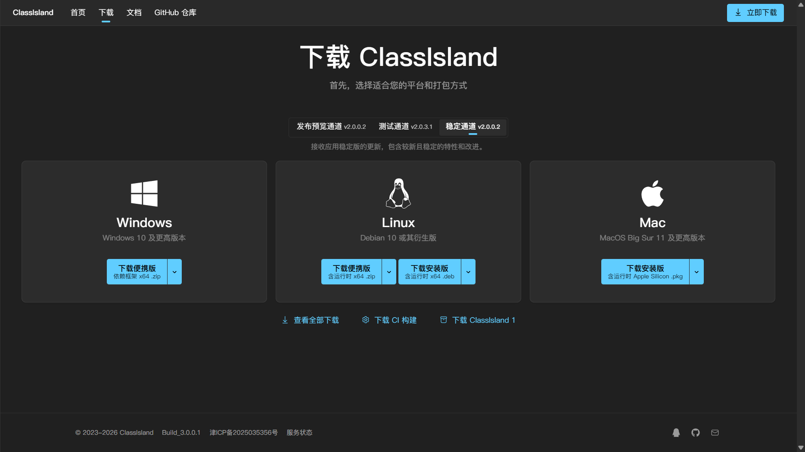

在 Windows 中，应用有“依赖框架”和“含运行时”两种构建模式。顾名思义，“含运行时”版包含了应用运行所需的运行时，后续安装步骤中无需再安装 .NET 运行时。而“依赖框架”版与前者相对，不包含运行时，需要在后续步骤手动安装 .NET 运行时。您可以根据需要选择对应的版本。

还记得刚刚查看的系统信息吗？您需要根据系统信息中的架构信息下载对应架构的应用。

**👉 如果您的系统架构为 x64，直接点击 Windows 下的蓝色下载按钮下载即可。如果您的系统属于其它架构，则需要点击蓝色下载按钮旁的向下箭头展开更多的下载选项，选择对应的架构下载。**

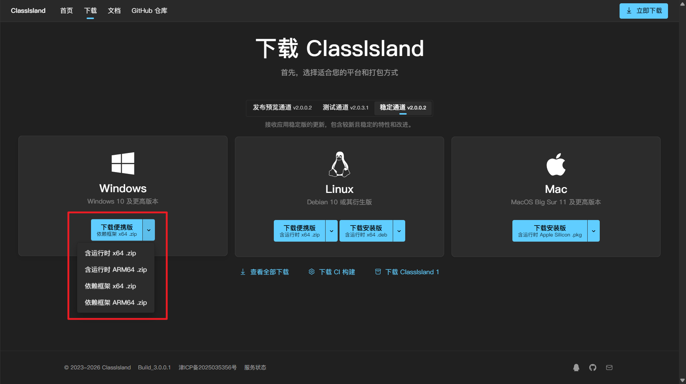

不出意外的话，您应该会跳转到下载界面并开始下载。等待下载完成后，我们就可以将应用安装到您的设备上了。

@tab macOS

**👉 在浏览器中打开<https://classisland.tech/download>。**

此时您应该能看到如下页面：


还记得刚刚查看的系统信息吗？您需要根据系统信息中的芯片类型信息下载适配对应芯片类型的应用。

**👉 如果您的设备使用 Apple Silicon 芯片，直接点击 macOS 下的蓝色下载按钮下载即可。如果您的设备使用其它芯片类型，则需要点击蓝色下载按钮旁的向下箭头展开更多的下载选项，选择对应的芯片类型下载。**

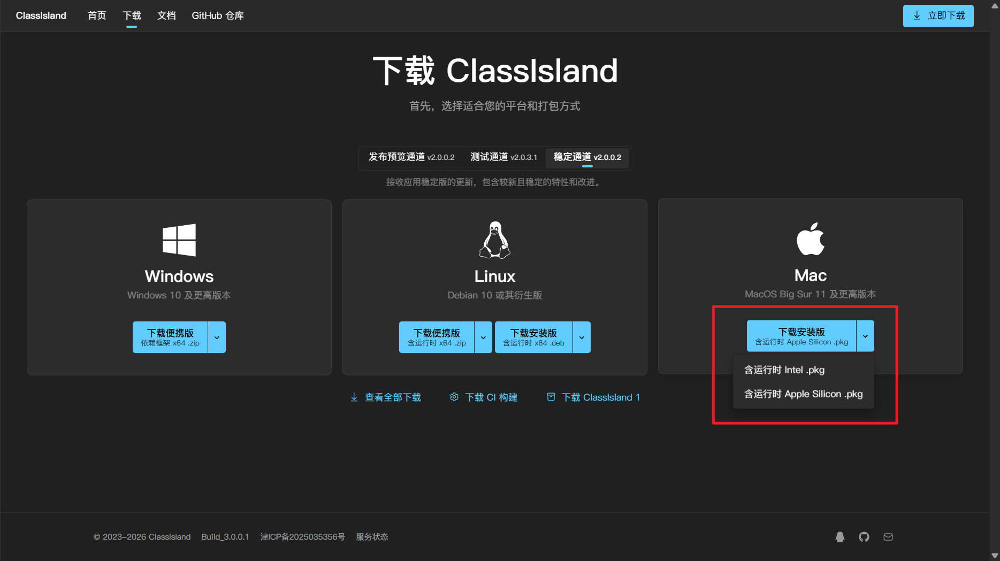

不出意外的话，您应该会跳转到下载界面并开始下载。等待下载完成后，我们就可以将应用安装到您的设备上了。

@tab 统信 UOS#uos

**👉 在启动器搜索并打开【应用商店】。**

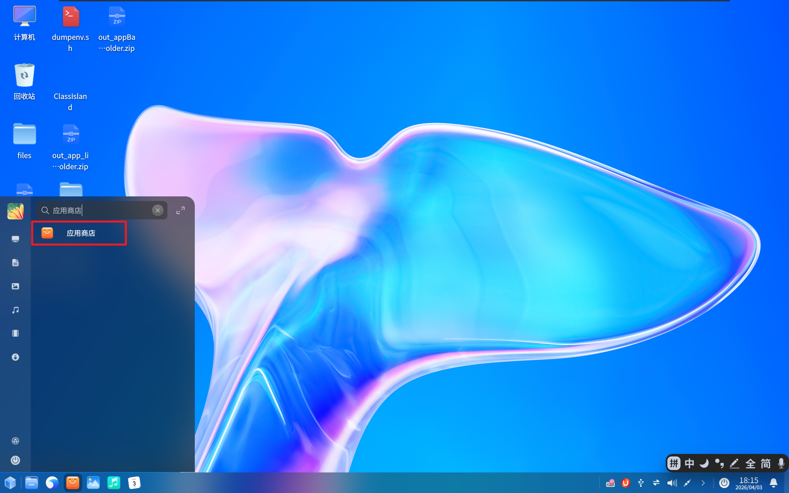

**👉 点击搜索框，在应用市场搜索【ClassIsland】，然后选择第一个名为`ClassIsland`的应用下载。**

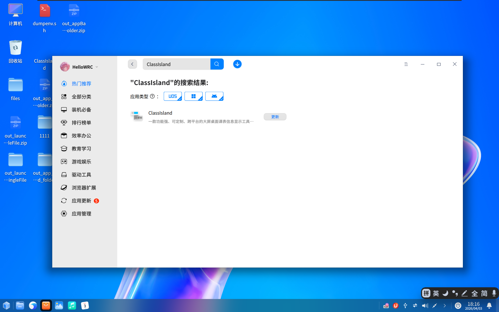

@tab 银河麒麟#kylin

**👉 在浏览器中打开<https://classisland.tech/download>。**

此时您应该能看到如下页面：


还记得刚刚查看的系统信息吗？您需要根据系统信息中的架构信息下载对应架构的应用。

ClassIsland 在 Linux 下同时支持”便携版“和”安装版“两种打包方式，方便起见，在此我们只介绍”安装版“的下载和安装方法。

**👉 如果您的系统属于 x86_64 架构，直接点击 Linux 下的右侧蓝色【下载安装版】按钮下载即可。如果您的系统属于其它架构，则需要点击蓝色【下载安装版】按钮旁的向下箭头展开更多的下载选项，选择对应的架构下载。**

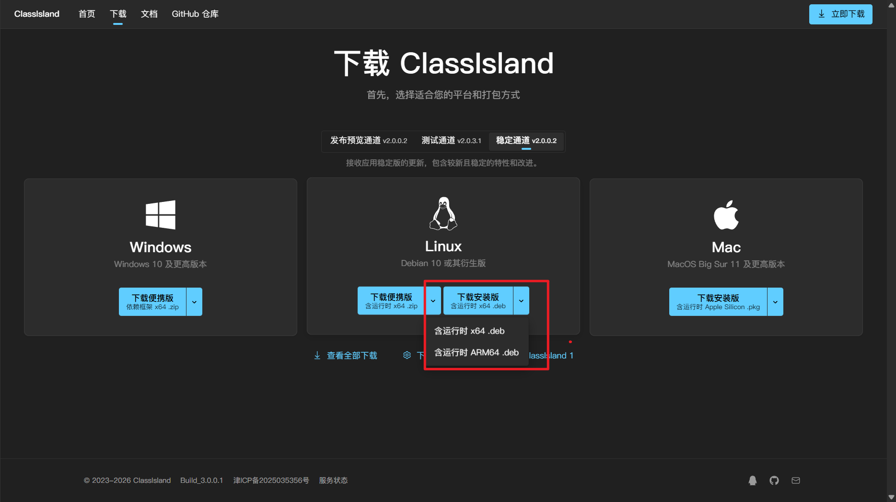

不出意外的话，您应该会跳转到下载界面并开始下载。等待下载完成后，我们就可以将应用安装到您的设备上了。

@tab 其它 Debian 衍生 OS#debian

**👉 在浏览器中打开<https://classisland.tech/download>。**

此时您应该能看到如下页面：


还记得刚刚查看的系统信息吗？您需要根据系统信息中的架构信息下载对应架构的应用。

ClassIsland 在 Linux 下同时支持【便携版】和【安装版】两种打包方式，方便起见，在此我们只介绍【安装版】的下载和安装方法。

**👉 如果您的系统属于 x86_64 架构，直接点击 Linux 下的右侧蓝色【下载安装版】按钮下载即可。如果您的系统属于其它架构，则需要点击蓝色【下载安装版】按钮旁的向下箭头展开更多的下载选项，选择对应的架构下载。**


不出意外的话，您应该会跳转到下载界面并开始下载。等待下载完成后，我们就可以将应用安装到您的设备上了。

:::

## 安装 ClassIsland

在下载好 ClassIsland 的安装包后，我们接下来要将其安装到设备上。

::: tabs#os

@tab Windows

在下载完成后，我们一般会得到一个压缩包。我们需要将其解压到一个文件夹中，才能开始使用 ClassIsland。

> [!important]
> 我们建议您将应用解压到 D 盘等非系统盘的根目录的一个独立的文件夹，如`D:\ClassIsland`中。文件路径最好不要有非 ASCII 字符（包括但不限于汉字、Emoji 等），以免出现奇奇怪怪的问题。

> [!caution]
>
> - 不要直接在压缩包内运行 ClassIsland。
> - 解压时请解压所有文件

**👉 使用压缩软件，将压缩包内的内容全部解压到一个独立的文件夹中（如`D:\ClassIsland`）。**

如果您下载的是“依赖框架”版本的 ClassIsland，您还需要安装 .NET 运行时。

**👉 双击运行 `ClassIsland.exe`，启动应用。如果出现下图提示，点击【Download it now】按钮，并按照提示说明安装 .NET 运行时。**

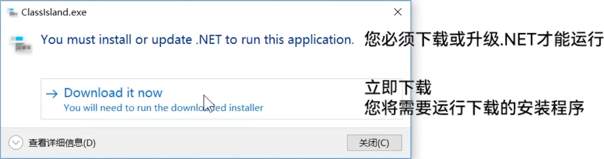

**👉 在安装完 .NET 运行时后，再次双击运行 `ClassIsland.exe`。**

如果一切正常，您应该能看到如下窗口：

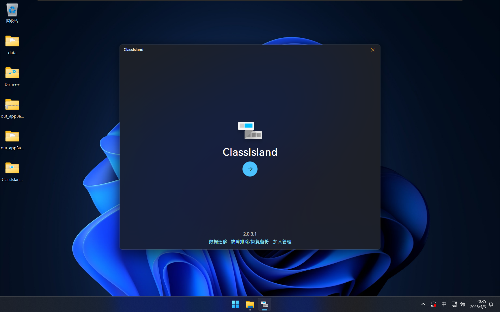

@tab macOS

**👉 双击打开刚刚下载好的安装包文件，然后按照安装器的提示进行安装。**

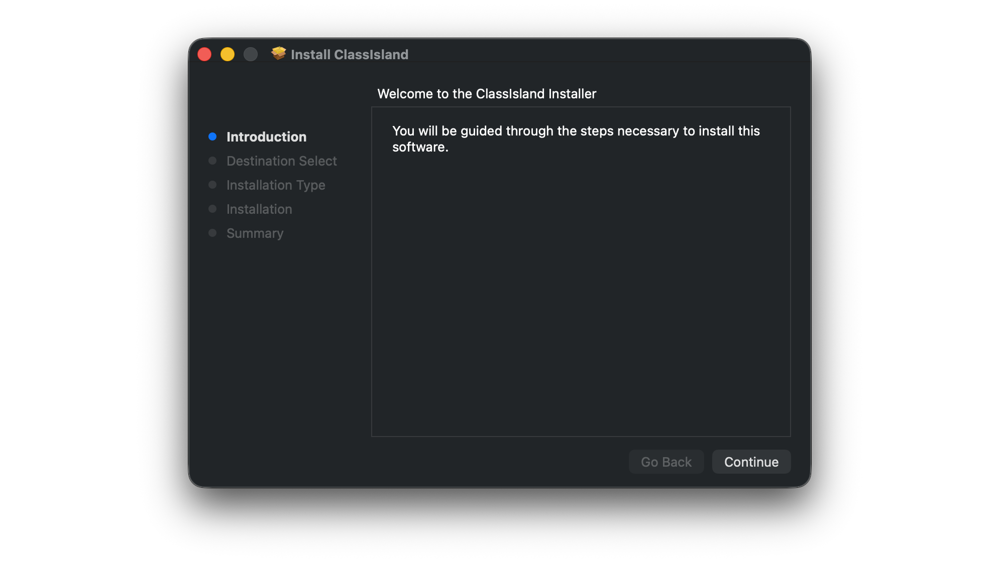

**👉 安装完成后，在启动台或“应用程序”界面中搜索并启动 ClassIsland。**

如果一切正常，您应该能看到如下窗口：

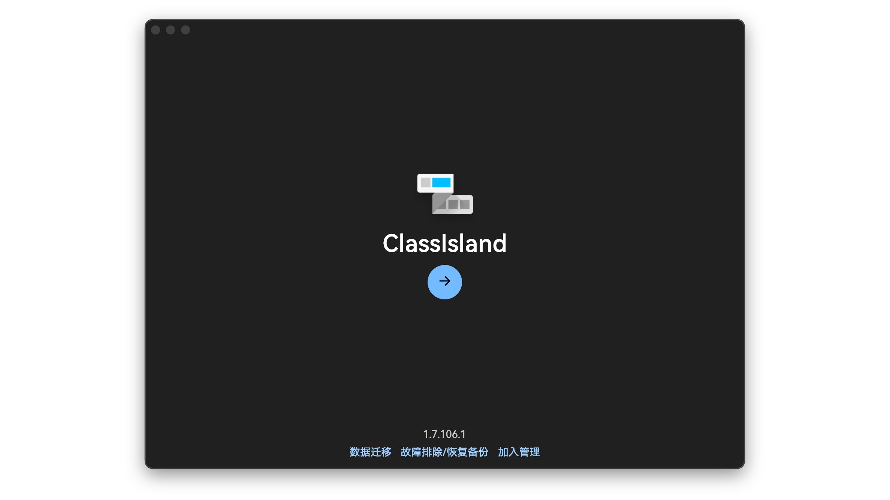

@tab 统信 UOS#uos

如果您按照上面的方法从应用商店下载了 ClassIsland，那么 ClassIsland 已经安装好了，接下来我们只需启动 ClassIsland。

**👉 在启动器搜索并启动【ClassIsland】。**


如果一切正常，您应该能看到如下窗口：

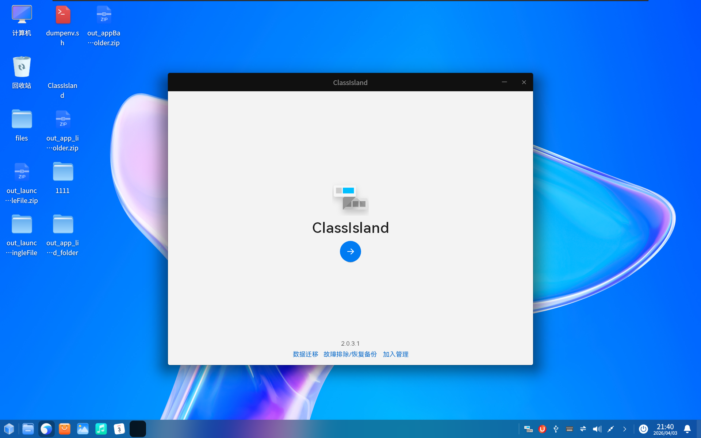

@tab 银河麒麟#kylin

**👉 双击打开刚刚下载好的安装包文件，然后按照安装器的提示进行安装。**

> [!important]
> 当出现询问是否允许安装未知来源应用的提示时，请点击【允许】。

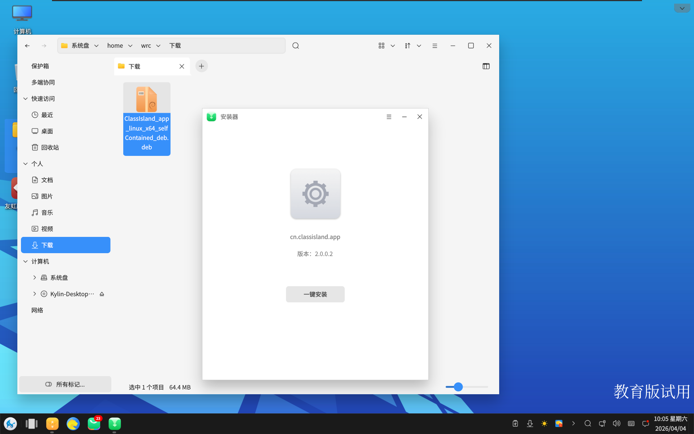

**👉 安装完成后，在启动台或“应用程序”界面中搜索并启动 ClassIsland。**

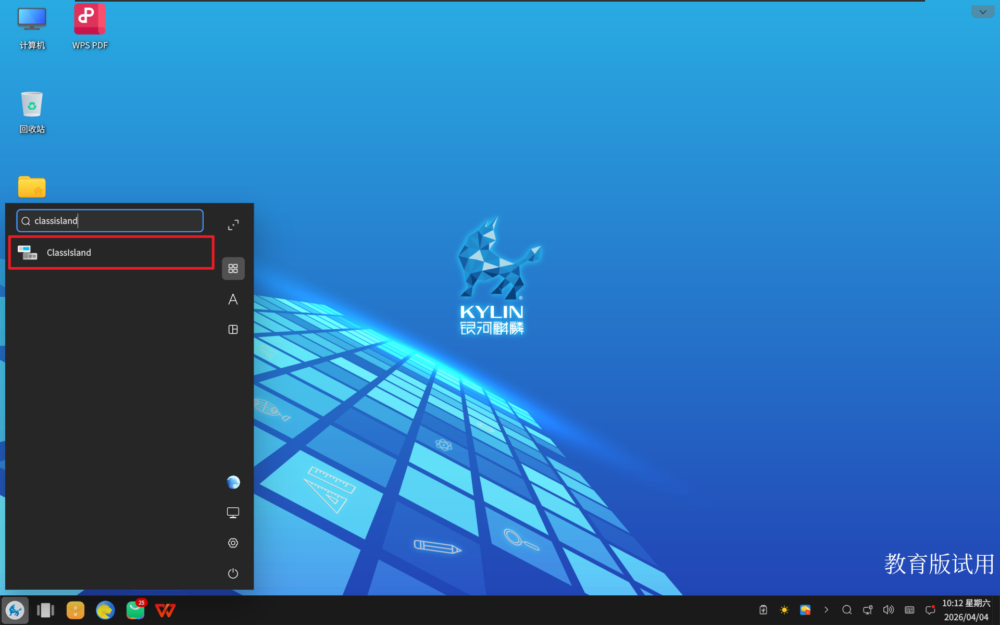

如果一切正常，您应该能看到如下窗口：

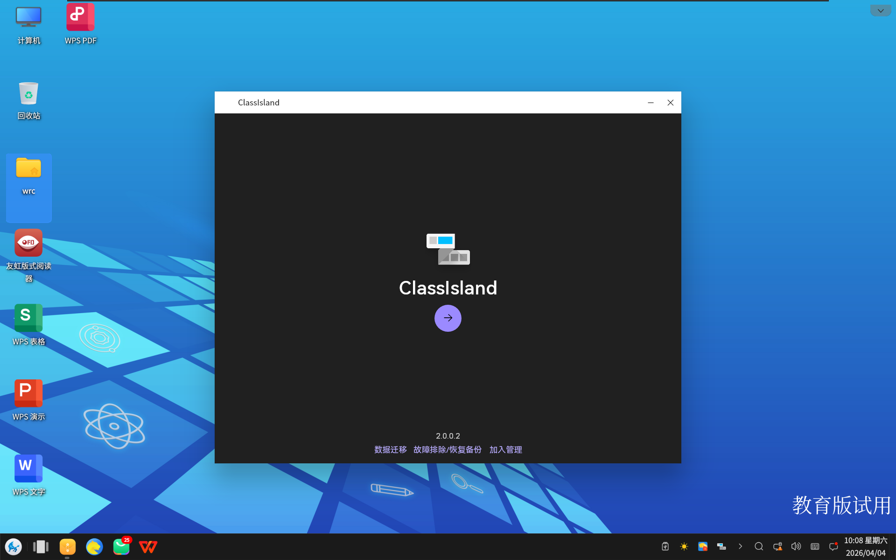

@tab 其它 Debian 衍生 OS#debian

**👉 在下载的 .deb 安装包文件夹打开终端，运行以下命令。**

```bash
sudo apt install ./你实际下载的文件名.deb
```

**👉 成功执行上述命令后，在应用程序启动器搜索并启动 ClassIsland。**

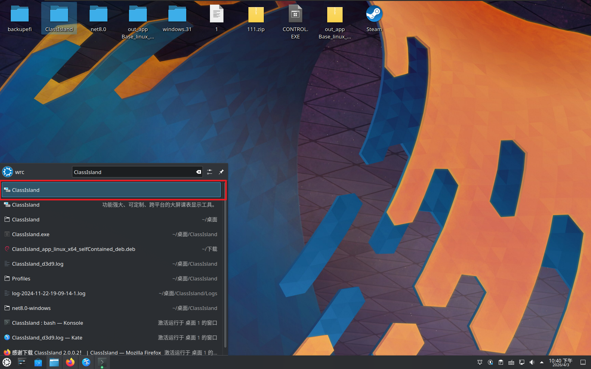

如果一切正常，您应该能看到如下窗口：

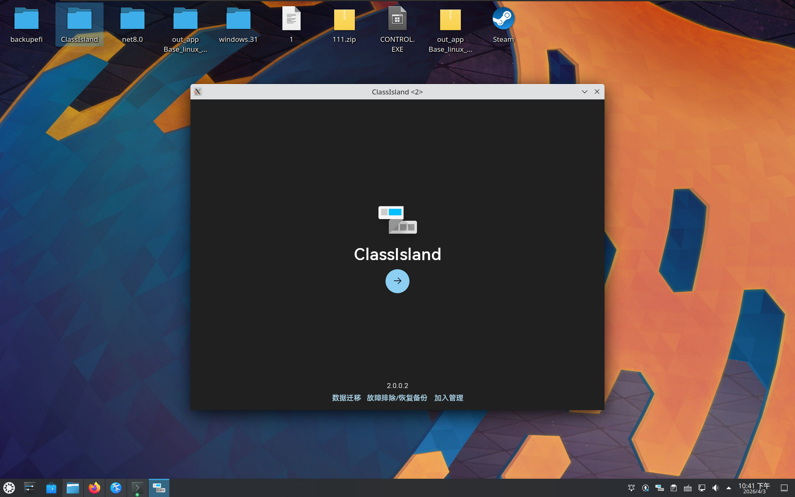

:::

## 初始设置

在安装完成后，我们接下来就可以进入初始设置环节了。由于这部分的操作在各个系统中基本一致，故不再分系统进行讲解。

在按照前面的步骤安装和正常启动应用后，我们便进入了欢迎向导，接下来您可以跟着欢迎向导一步步地完成应用的初始设置。

**👉 按欢迎向导指引完成应用初始设置。**

当完成欢迎向导后，应用将重启。随后，我们应该能看到这样的界面：

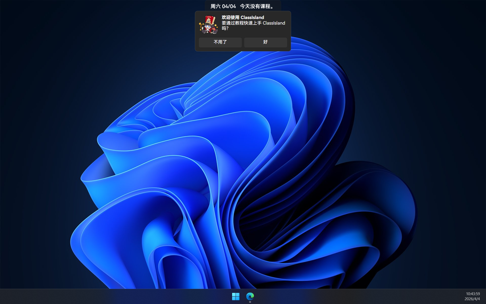

**🎉恭喜！至此您已完成了 ClassIsland 的安装操作。**
